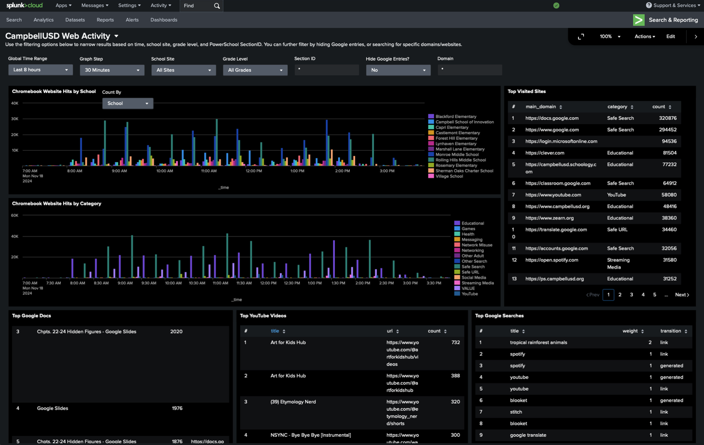
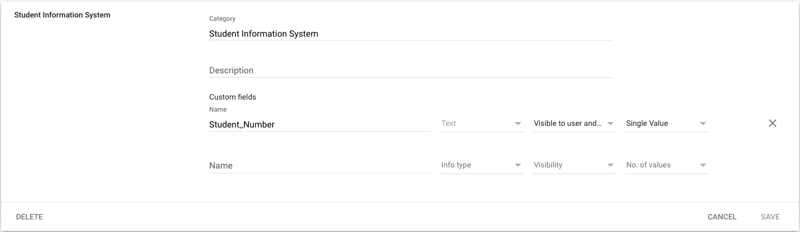
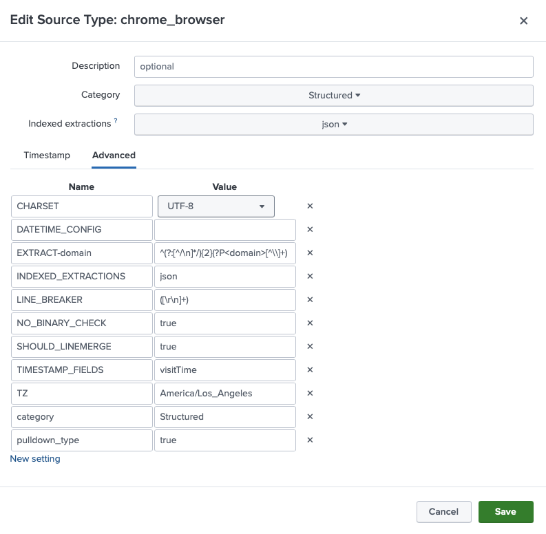
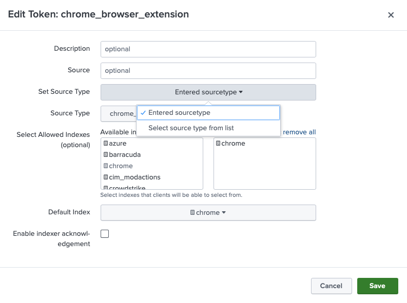

# Chrome History Logger

This repo contains what you will need to start logging web traffic from Google Admin accounts via a custom Chrome extension. This implementation ingests data from Google Admin, PowerSchool, and Securly and sends the correlated web traffic data to Splunk for analysis. This is how we set it up for Campbell Union School District, you're welcome to modify it to meet your specific use case.

## Requirements

- Internet accessible host with PHP 8.0+
- Google Developer account with access to Google Admin
- Composer [https://getcomposer.org/download/](https://getcomposer.org/download/)

## Installation

- Install Google API via composer (composer.json included in wwwroot) [https://github.com/googleapis/google-api-php-client](https://github.com/googleapis/google-api-php-client)
- Setup env variables
	- CRON (arbitrary key used for crontab)
	- GOOGLE_APPLICATION_CREDENTIALS ([/credentials/google_service_account.json](/credentials/google_service_account.json))
	- GOOGLE_USER (user account to impersonate with access to student account info)
	- SPLUNK_AUTH (key for Splunk API pushes)
- To correlate student data with Google IDs
	- Setup regular exports from PowerSchool with the header formats shown in the files:
		- [/share/powerschoolftp/chromebook_history_cc.csv](share/powerschoolftp/chromebook_history_cc.csv)
		- [/share/powerschoolftp/chromebook_history_student.csv](share/powerschoolftp/chromebook_history_student.csv)
	- Add Student IDs to Google with a private custom attribute [https://support.google.com/a/answer/6208725](https://support.google.com/a/answer/6208725) 
	- Setup school and grade info from Google (We used OU structure. See line 92 and 93 in [/site/wwwroot/cron.php](site/wwwroot/cron.php) This exports to [/site/cache/userinfo.json](site/cache/userinfo.json)) 
- To enable categorization, add domains to the file [/site/wwwroot/domains.json](site/wwwroot/domains.json), or use the [/site/wwwroot/getcategories.php](site/wwwroot/getcategories.php) script to extract them from a securly log export file added to [/site/securlylogs](site/securlylogs)
- Create and deploy logger Chrome extension
	- Add path to your hosted [/site/wwwroot](site/wwwroot) to the Chrome extension ("hostedPath" variable in [/logger/background.js](logger/background.js))
	- Create a unique name for the extension in [/logger](logger) by changing the [/logger/manifest.json](logger/manifest.json)
	- Zip and submit /logger to the Chrome Developer Dashboard for approval as a private extension [https://chrome.google.com/webstore/devconsole](https://chrome.google.com/webstore/devconsole)
	- Once approved by Google, ensure student chromebooks have submitted extension force installed
- Setup Splunk to recieve and display the data
	- Create index called "chrome" (allows permissioning and data retention settings) [https://docs.splunk.com/Documentation/Splunk/latest/Indexer/Setupmultipleindexes](https://docs.splunk.com/Documentation/Splunk/latest/Indexer/Setupmultipleindexes) 
	- Create Source Type called "chrome_browser" (defines json data parsing) [https://docs.splunk.com/Documentation/SplunkCloud/latest/Data/Createsourcetypes](https://docs.splunk.com/Documentation/SplunkCloud/latest/Data/Createsourcetypes) 
	- Create HTTP Event Collector called "chrome_browser_extension" (creates the token for API access) [https://docs.splunk.com/Documentation/SplunkCloud/latest/Data/UsetheHTTPEventCollector](https://docs.splunk.com/Documentation/SplunkCloud/latest/Data/UsetheHTTPEventCollector) 
	- Create the dashboard
		- Add school labels (They need to correspond to the school data in the [/site/cache/userinfo.json](site/cache/userinfo.json). Edit this in the "input_OBi9hlrC" area of [Web Activity Dashboard.json](Web Activity Dashboard.json))
		- Import your edited dashboard file [https://docs.splunk.com/observability/en/data-visualization/dashboards/dashboards-import-export.html](https://docs.splunk.com/observability/en/data-visualization/dashboards/dashboards-import-export.html)
